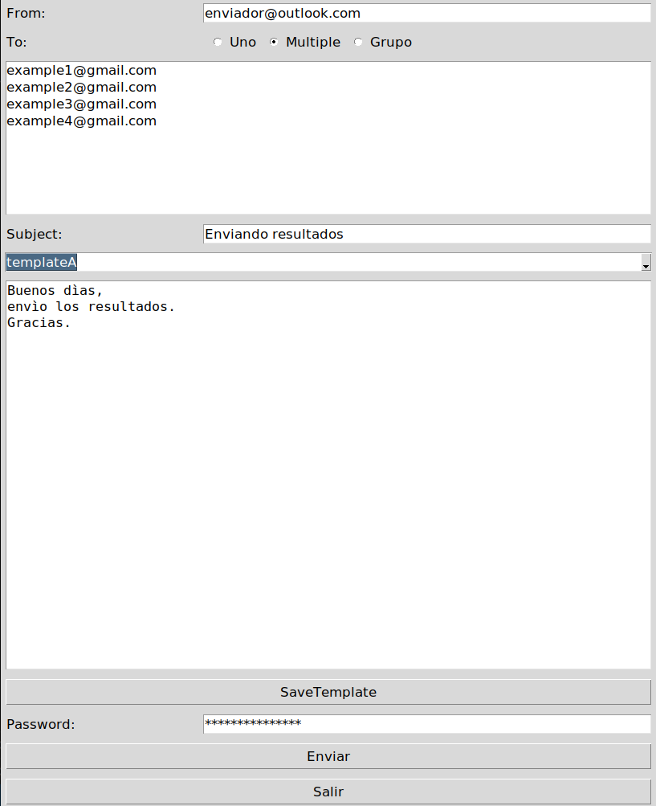

# MailFaster
Interface project for sending emails through the use of pre-saved recurring templates.

## How to use

This interface use Tkinter. You can install it with this command:

```bash
sudo apt install python3-tk
```

Then, run `fastmail.py` to start the interface:

```bash
python3 fastmail.py
```

At first, you need to add your recurring emails and the templates you use with the "Save Template" button. For this, you just need to write to their respective textBoxes and then the interface will save it in a JSON in the same path of the scripts.



> Currently, it is configured to only send from Microsoft Server ("outlook" or derivatives), but if you need to send from Gmail, you can edit line 23 of `mailFast.py` to change the "outlook" server parameter to "gmail".
